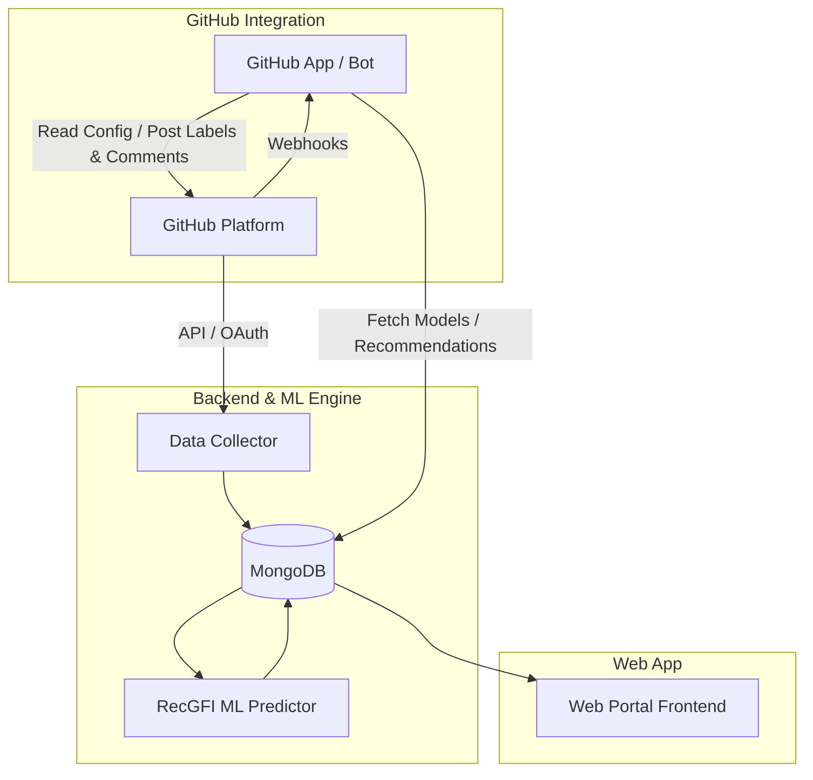

# GFI-Bot Use Cases and System Specification

For efficient design and implementation of user-visible features across the backend, frontend, and GitHub App, it is important for the project to maintain a consensual understanding of typical workflows. This document details the system overview, user personas, structured use cases, functional and non-functional requirements, and data specifications for GFI-Bot.

---

## Table of Contents

- [1. System Overview](#1-system-overview)
- [2. User Personas](#2-user-personas)
  - [Alice - CS Student / Newcomer (General Search)](#alice---cs-student--newcomer-general-search)
  - [Bob - Software Engineer / Corporate Contributor (Targeted Onboarding)](#bob---software-engineer--corporate-contributor-targeted-onboarding)
  - [Carol - Open Source Project Founder / Lead Maintainer](#carol---open-source-project-founder--lead-maintainer)
- [3. Structured Use Cases](#3-structured-use-cases)
  - [UC-01: Discover and Filter Good First Issues (General Exploration)](#uc-01-discover-and-filter-good-first-issues-general-exploration)
  - [UC-02: Find Good First Issues for a Specific Project](#uc-02-find-good-first-issues-for-a-specific-project)
  - [UC-03: Evaluate System Performance and Establish Trust](#uc-03-evaluate-system-performance-and-establish-trust)
  - [UC-04: Register Repository for GFI Recommendation](#uc-04-register-repository-for-gfi-recommendation)
  - [UC-05: Inspect RecGFI Effectiveness in Target Repository](#uc-05-inspect-recgfi-effectiveness-in-target-repository)
  - [UC-06: Configure Automated GitHub App Integration](#uc-06-configure-automated-github-app-integration)
- [4. Functional & Non-Functional Requirements](#4-functional--non-functional-requirements)
  - [4.1 Functional Requirements](#41-functional-requirements)
  - [4.2 Non-Functional Requirements](#42-non-functional-requirements)
- [5. Repository Metrics & Data Requirements](#5-repository-metrics--data-requirements)
  - [5.1 Repository Metrics & Relative Rankings](#51-repository-metrics--relative-rankings)
  - [5.2 Project Metadata & Text Indexing](#52-project-metadata--text-indexing)
  - [5.3 Repository Configuration Specification (`.github/gfibot.yaml`)](#53-repository-configuration-specification-githubgfibotyaml)

---

## 1. System Overview

GFI-Bot is an ML-powered platform designed to lower the barrier for open-source software (OSS) newcomers while reducing the manual triage burden on project maintainers. The system consists of three core components:

1. **Web Portal (Frontend)**: A web interface allowing newcomers to discover candidate projects and Good First Issues (GFIs), explore repository health metrics, and enable maintainers to register repositories, monitor bot performance, and generate repository badges.
2. **Backend & Machine Learning Engine**: A scalable backend that collects GitHub repository statistics, indexes metadata for keyword search, trains machine learning models (RecGFI) using historical issue resolution data, evaluates model performance (AUC), and computes relative metrics.
3. **GitHub App (Bot Integration)**: An automated GitHub bot that listens to repository webhook events, evaluates newly created or triaged issues using the trained model, and automatically applies GFI labels and comments according to project-specific configuration files (`.github/gfibot.yaml`).



---

## 2. User Personas

### Alice - CS Student / Newcomer (General Search)
- **Role**: Computer Science Student / OSS Beginner.
- **Background**: Possesses basic programming knowledge from coursework but lacks experience with real-world software engineering practices. Interested in contributing to open source to gain practical experience.
- **Goals**: Find beginner-friendly open-source projects and locate genuine Good First Issues without feeling overwhelmed.
- **Pain Points**: Struggles to identify newcomer-friendly projects among millions of repositories; existing GFI labels are scarce, often mislabeled, or claimed rapidly.

### Bob - Software Engineer / Corporate Contributor (Targeted Onboarding)
- **Role**: Professional Software Engineer.
- **Background**: Works at a company relying heavily on a specific open-source library. Tasked by management to onboard to the repository and become an active contributor.
- **Goals**: Quickly identify accessible entry-level issues within a designated target project to build familiarity and establish community trust.
- **Pain Points**: Inspecting hundreds of open issues manually takes too much time; target project might not actively label GFIs.

### Carol - Open Source Project Founder / Lead Maintainer
- **Role**: Project Founder / Core Maintainer.
- **Background**: Leads a popular open-source repository and wants to attract new contributors.
- **Goals**: Automate the identification and labeling of GFIs to onboard newcomers efficiently without spending substantial manual triage time.
- **Pain Points**: Extremely busy with core development and code reviews; lacks time to manually evaluate and label every incoming issue.

---

## 3. Structured Use Cases

### UC-01: Discover and Filter Good First Issues (General Exploration)
- **Primary Actor**: Alice (Newcomer without a specific target project).
- **Goal**: Discover newcomer-friendly projects and identify recommended Good First Issues matching personal skills and interests.
- **Preconditions**: GFI-Bot web portal is accessible.
- **Trigger**: Newcomer visits the GFI-Bot web portal.
- **Main Flow**:
  1. User navigates to the GFI-Bot web portal project search page.
  2. User filters or searches projects by programming languages, domain tags, or text keywords (matching name, description, README).
  3. User sorts candidate projects by popularity, activity, or newcomer-friendliness metrics.
  4. User views repository health metrics and relative percentile rankings (e.g., issue response time faster than 90% of repos).
  5. User selects a project to view its list of recommended GFIs, sorted by ML-predicted GFI likelihood score and existing manual labels.
  6. User clicks an issue link to navigate to GitHub and begin contributing.
- **Postconditions**: User successfully finds a candidate GFI aligned with their background.

### UC-02: Find Good First Issues for a Specific Project
- **Primary Actor**: Bob (Contributor with a specific project in mind).
- **Goal**: Locate starter issues within a designated open-source repository.
- **Preconditions**: Target repository is identified.
- **Trigger**: User needs to onboard to a specific open-source codebase.
- **Main Flow**:
  1. User visits the target repository's GitHub README or issue tracker.
  2. If the repository displays a GFI-Bot badge, user clicks the badge to open the project's dedicated GFI-Bot portal page.
  3. If the repository does not use GFI-Bot, user navigates to the GFI-Bot web portal to register the repository.
  4. User authenticates or provides a donated GitHub access token to submit the repository for GFI recommendation indexing.
  5. User views the computed list of recommended GFIs for the target project via the portal.
- **Postconditions**: Target repository is indexed (if unregistered), and recommended GFIs are presented to the contributor.

### UC-03: Evaluate System Performance and Establish Trust
- **Primary Actor**: Carol (Project Maintainer).
- **Goal**: Assess GFI-Bot's credibility and prediction effectiveness prior to adopting the bot.
- **Preconditions**: GFI-Bot web portal homepage is accessible.
- **Trigger**: Maintainer considers automating GFI triage for their repository.
- **Main Flow**:
  1. Maintainer visits the GFI-Bot homepage.
  2. Maintainer reviews global system statistics: overall dataset scale, global model prediction performance (AUC), and total issues successfully resolved by newcomers via GFI-Bot.
  3. Maintainer reviews real-world case studies demonstrating newcomer conversion.
- **Postconditions**: Maintainer establishes confidence in GFI-Bot's recommendation accuracy.

### UC-04: Register Repository for GFI Recommendation
- **Primary Actor**: Carol (Project Maintainer) / Bob (Community Contributor).
- **Goal**: Register a GitHub repository with GFI-Bot for automated data collection and GFI recommendation.
- **Preconditions**: User has a valid GitHub account / access token.
- **Trigger**: User wants GFI recommendations for an unindexed repository.
- **Main Flow**:
  1. User logs into the GFI-Bot web portal via GitHub OAuth or submits a registration form with a GitHub access token.
  2. User inputs the GitHub repository name (e.g., `owner/repo`).
  3. GFI-Bot initiates background data ingestion, displaying real-time progress and GitHub API rate limit consumption.
  4. User configures data update frequency (manual sync vs. scheduled recurring interval).
  5. System generates an HTML/Markdown badge code snippet linking directly to the project's GFI portal page.
  6. Maintainer embeds the badge into the repository `README.md`.
- **Postconditions**: Repository data is synced, indexed, and accessible on the web portal with an active README badge.

### UC-05: Inspect RecGFI Effectiveness in Target Repository
- **Primary Actor**: Carol (Project Maintainer).
- **Goal**: Monitor repository-specific ML model performance and evaluate newcomer conversion impact.
- **Preconditions**: Repository data collection is complete.
- **Trigger**: Historical issue data sync finishes or maintainer opens repository dashboard.
- **Main Flow**:
  1. System trains a repository-tuned RecGFI model using historical resolved issue data (differentiating newcomer vs. non-newcomer resolvers).
  2. System predicts GFI probability scores for all open issues.
  3. System evaluates local model performance metrics and presents optimization recommendations on the repository dashboard.
  4. Portal highlights open issues predicted as GFIs that were subsequently resolved by newcomers, demonstrating impact.
- **Postconditions**: Maintainer receives actionable insights into local model performance and newcomer engagement.

### UC-06: Configure Automated GitHub App Integration
- **Primary Actor**: Carol (Project Maintainer).
- **Goal**: Automate real-time GFI labeling and commenting on newly submitted or triaged issues via GitHub App integration.
- **Preconditions**: GFI-Bot GitHub App is installed on the target repository.
- **Trigger**: Maintainer commits a configuration file `.github/gfibot.yaml` to the repository.
- **Main Flow**:
  1. Maintainer installs the GFI-Bot GitHub App on GitHub.
  2. Maintainer creates and commits `.github/gfibot.yaml` with custom parameters (e.g., newcomer commit threshold, target triage labels, output GFI labels, probability threshold, comment toggle).
  3. When a new issue is opened or updated on GitHub, GFI-Bot receives a webhook event.
  4. GFI-Bot parses `.github/gfibot.yaml`, evaluates the issue with the corresponding ML model, and if the score meets the threshold, automatically applies GFI labels and posts an informative comment.
- **Postconditions**: Incoming issues are automatically labeled and commented based on project-defined rules.

---

## 4. Functional & Non-Functional Requirements

### 4.1 Functional Requirements

- **FR-1: Multi-Criteria Project Search & Filtering**: The web portal must enable users to search projects by keyword (name, description, README) and filter by programming language, topics/tags, popularity, activity, and newcomer-friendliness metrics.
- **FR-2: Relative Metric Computation**: The system must compute percentile rankings for repository metrics (e.g., issue response time, close time) relative to all collected repositories.
- **FR-3: ML-Powered GFI Recommendation**: The RecGFI engine must calculate GFI probability scores for open issues based on issue text, historical resolution patterns, and contributor activity.
- **FR-4: Repository Registration & Token Donation**: The portal must support repository registration via GitHub OAuth or donated GitHub access tokens, providing real-time progress and API rate limit tracking.
- **FR-5: Badge Generation**: The system must automatically generate embeddable HTML/Markdown badges linking users to repository-specific GFI recommendation pages.
- **FR-6: GitHub App Webhook Integration**: The GitHub App must handle issue creation/update webhooks and trigger ML predictions in real time.
- **FR-7: Declarative Configuration (`.github/gfibot.yaml`)**: The GitHub App must parse repository-level YAML config to control newcomer thresholds, target issue filters, applied labels, probability thresholds, and comment generation.
- **FR-8: Performance Analytics Dashboard**: The portal must display overall system performance (scale, AUC, newcomer resolution count) and per-repository model evaluation stats.

### 4.2 Non-Functional Requirements

- **NFR-1: Performance & Scalability**: Background data collection must process large repositories without blocking the REST API or web portal. Full-text search over project descriptions and READMEs must return results in under 500ms.
- **NFR-2: Rate Limit Management**: The data collector must manage multiple GitHub API tokens gracefully, distributing requests to prevent rate limit exhaustion.
- **NFR-3: Usability & Accessibility**: The web portal must provide an intuitive visual hierarchy, clear data visualizations for metrics/rankings, and straightforward repository onboarding workflows.
- **NFR-4: Reliability & Accuracy**: GFI prediction models should maintain high classification performance (AUC), and model retraining must execute periodically as new resolved issues accumulate.
- **NFR-5: Security & Privacy**: User GitHub access tokens donated for repo indexing must be securely stored and used strictly for GitHub API data synchronization.

---

## 5. Repository Metrics & Data Requirements

### 5.1 Repository Metrics & Relative Rankings

To help newcomers evaluate candidate projects and find suitable GFIs, the system collects and displays key metrics alongside relative percentile rankings:

| Metric Category | Data Field | Description | Relative Ranking Purpose |
| :--- | :--- | :--- | :--- |
| **Popularity** | `stars` | Total GitHub star count | Compare project popularity |
| **Activity** | `commits` | Total commit count | Assess project development activity |
| **Activity** | `issues` | Total issue count (open & closed) | Evaluate community engagement |
| **Activity** | `prs` | Total pull request count | Assess contribution volume |
| **Responsiveness**| `median_issue_response_time` | Median duration until first maintainer response | High responsiveness ranks in top percentiles |
| **Resolution** | `median_issue_close_time` | Median duration to close/resolve an issue | Evaluate issue resolution speed |
| **Newcomer Focus** | `resolved_by_newcomers` | Count of issues resolved by newcomer contributors | Highlight newcomer-friendly projects |

### 5.2 Project Metadata & Text Indexing

For project search and domain filtering, GFI-Bot collects and indexes the following metadata fields:

- **Project Identifiers**: Repository owner, repository name, full name.
- **Textual Content**: Project description, `README.md` text content (indexed for keyword search).
- **Categorization**: Primary programming languages, repository topics/tags.

### 5.3 Repository Configuration Specification (`.github/gfibot.yaml`)

Maintainers can configure GFI-Bot behavior by placing a `.github/gfibot.yaml` file in their repository root:

```yaml
# .github/gfibot.yaml - GFI-Bot Configuration Specification

# 1. Number of within-repository commits required to disqualify a developer as a newcomer.
# Allowed range: 1 to 5 (Default: 3). Determines which trained model variant to select.
newcomer_commit_threshold: 3

# 2. Issue filtering: list of labels required on open issues before GFI-Bot evaluates them.
# Empty list means evaluate all new open issues.
target_issue_labels:
  - "confirmed"
  - "triaged"

# 3. List of labels to automatically apply when an issue meets the GFI probability threshold.
gfi_labels:
  - "good first issue"
  - "first-timers-only"

# 4. Minimum ML probability threshold required to apply GFI labels (0.0 to 1.0).
probability_threshold: 0.6

# 5. Toggle whether GFI-Bot posts an explanatory comment on qualified open issues.
comment_enabled: true
```

#### Parameter Breakdown

| Parameter | Type | Default | Allowed Values | Description |
| :--- | :--- | :--- | :--- | :--- |
| `newcomer_commit_threshold` | Integer | `3` | `1` - `5` | Maximum commit count within the repository to classify a contributor as a newcomer. Controls model selection. |
| `target_issue_labels` | List[String]| `[]` | Any label strings | Required existing labels on open issues before GFI-Bot evaluates them (e.g. triage filters). |
| `gfi_labels` | List[String]| `["good first issue"]` | Any label strings | Labels to add when an issue is predicted as a GFI. |
| `probability_threshold` | Float | `0.5` | `0.0` - `1.0` | Probability cutoff for automated GFI labeling. |
| `comment_enabled` | Boolean | `true` | `true`, `false` | Whether to post a bot comment explaining GFI probability score on qualified issues. |
